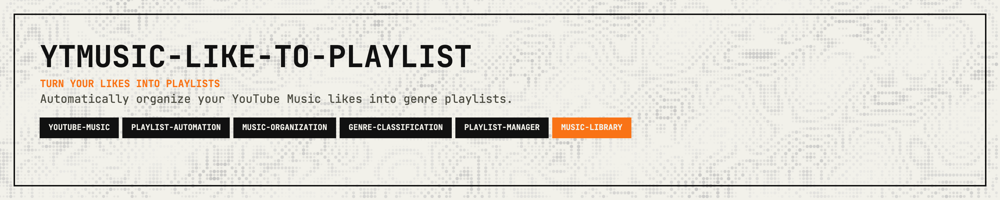

<p align="center">
  
</p>

<p align="center">
  <a href="https://www.rust-lang.org"></a>
  <a href="https://music.youtube.com"></a>
  <a href="https://www.last.fm/api"></a>
  <a href="https://github.com/woldp001/ytmusic-like-to-playlist/pulls"></a>
</p>

<p align="center">
  <a href="#what-it-does">What it does</a> · <a href="#requirements">Requirements</a> · <a href="#setup">Setup</a> · <a href="#usage">Usage</a> · <a href="#project-structure">Project structure</a> · <a href="#license">License</a>
</p>

---

Sync your YouTube Music liked songs into genre-based playlists using Last.fm for genre detection.

## What it does
<a id="what-it-does"></a>

1. Fetches your liked songs from YouTube Music
2. For each song: checks if it's already in one of your genre playlists (skips Last.fm lookup if so)
3. Otherwise detects genre via Last.fm (with optional overrides from config)
4. Adds the song to the playlist mapped to that genre in `playlist_rules`

## Requirements
<a id="requirements"></a>

- [Rust](https://rustup.rs/) (edition 2024)
- A [Last.fm API key](https://www.last.fm/api/account/create)
- YouTube Music cookies from a logged-in browser session

## Setup
<a id="setup"></a>

### 1. Auth file (`auth.json`)

Create `auth.json` with your credentials:

```json
{
  "cookie": "YOUR_FULL_COOKIE_STRING",
  "x-goog-authuser": "0",
  "lastfm_api_key": "YOUR_LASTFM_API_KEY"
}
```

**Getting YouTube Music cookies:**

1. Open [YouTube Music](https://music.youtube.com) and sign in
2. Open Developer Tools (F12) → Network tab
3. Filter for `browse` requests and reload
4. Select a `browse` request → Request Headers
5. Copy the full `cookie` value and `x-goog-authuser` (usually `0`)

**Security:** Keep `auth.json` private — it grants access to your account.

### 2. Config file (`config.json`)

```json
{
  "canonical_rules": [
    ["black metal", "metal"],
    ["death metal", "metal"],
    ["hip-hop", "hiphop"]
  ],
  "genre_overrides": {
    "Song Title": "genre"
  },
  "playlist_rules": {
    "metal": "metal shit",
    "hiphop": "hip hop mix"
  }
}
```

- **canonical_rules**: Map Last.fm tags to canonical genres `[pattern, canonical]`
- **genre_overrides**: Per-song overrides `{ "Song Title": "genre" }`
- **playlist_rules**: Map genre → your YTM playlist name `{ "metal": "metal shit" }`

Copy `config.json.example` to get started.

## Usage
<a id="usage"></a>

**Sync** (adds songs to genre playlists):

```bash
cargo run
```

**Display only** (show liked songs with Last.fm genres, no sync):

```bash
cargo run -- --display
```

With options:

```bash
cargo run -- --auth auth.json --config config.json --limit 50
cargo run -- --display --limit 20
```

| Flag       | Default     | Description                                  |
|------------|-------------|----------------------------------------------|
| `--auth`   | `auth.json` | Path to auth file                            |
| `--config` | `config.json` | Path to config file                        |
| `--limit`  | (none)      | Max liked songs to process                   |
| `--display`| `false`     | Only display liked songs with genres (no sync) |

## Project structure
<a id="project-structure"></a>

- `auth.json` — Credentials (gitignored; use `auth.json.example` as template)
- `config.json` — Genre rules and playlist mapping
- `src/main.rs` — `YtMusicGenreSyncer` struct and CLI

## Contributing

Contributions are welcome! Please feel free to submit a Pull Request.

1. Fork the repository
2. Create your feature branch (`git checkout -b feature/cool-feature`)
3. Commit your changes (`git commit -m 'Add some cool feature'`)
4. Push to the branch (`git push origin feature/cool-feature`)
5. Open a Pull Request

## Support

If this crate saves you time or helps your work, support is appreciated:

[](https://ko-fi.com/11philip22)

## License

This project is licensed under the MIT License; see the [license](https://opensource.org/licenses/MIT) for details.